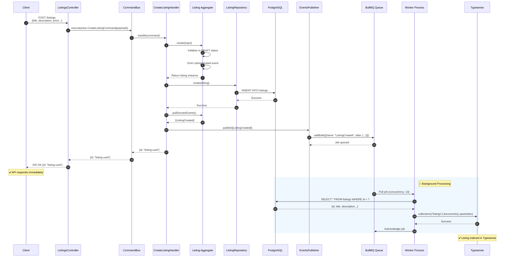
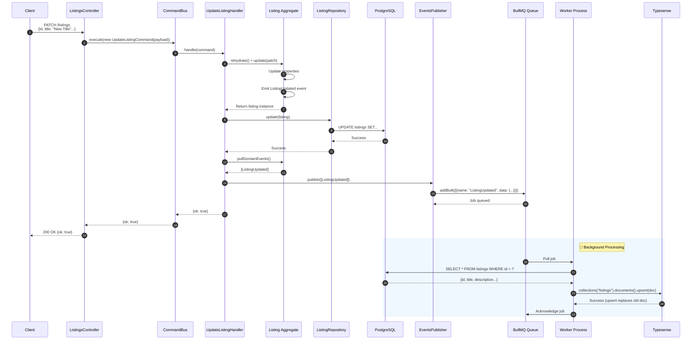
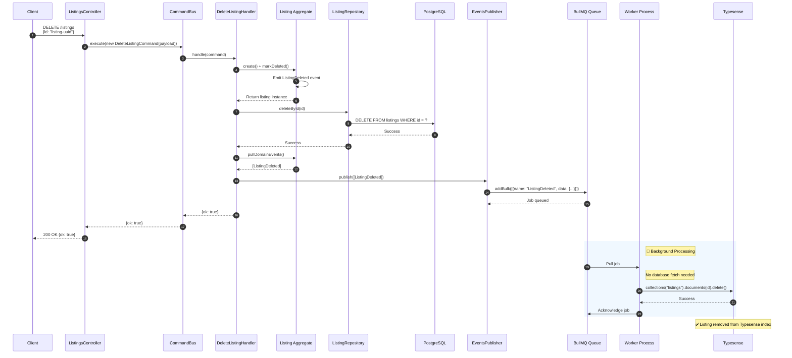
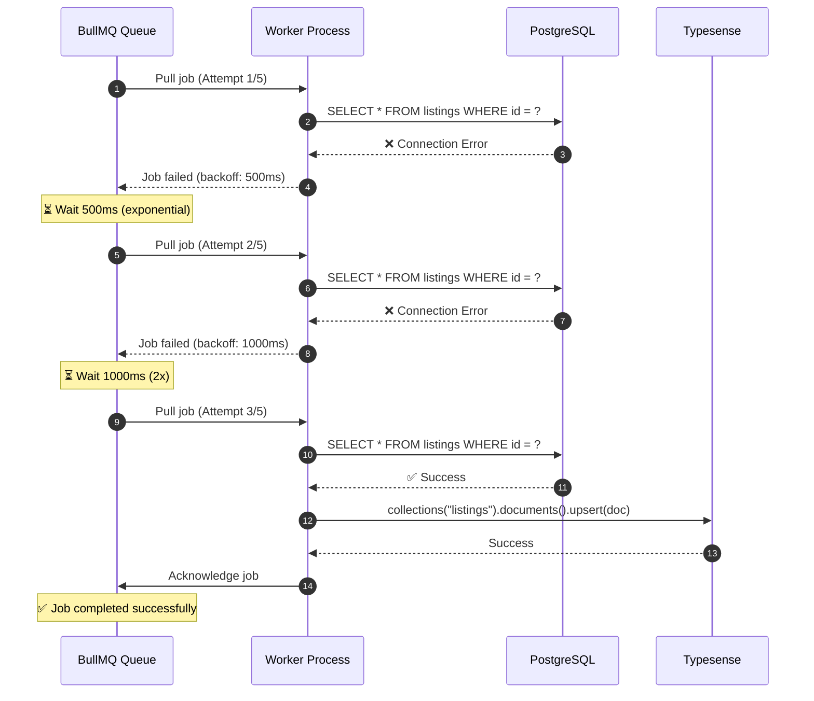

# Events Explained

## Table of Contents

- [Introduction](#introduction)
- [Domain Events](#domain-events)
- [Event Flow Overview](#event-flow-overview)
- [Detailed Event Workflows](#detailed-event-workflows)
- [Worker Architecture](#worker-architecture)
- [Sequence Diagrams](#sequence-diagrams)
- [Error Handling](#error-handling)
- [File References](#file-references)

---

## Introduction

Malkiat Backend uses an event-driven architecture where domain events are emitted by aggregates after successful state changes. These events are published to a message queue and consumed by a separate worker process to update the read model (Typesense search index).

This approach provides:

- **Decoupling**: Write model (PostgreSQL) and read model (Typesense) are independent
- **Scalability**: Events can be processed asynchronously
- **Reliability**: Queue ensures no events are lost
- **Performance**: API responses are fast; indexing happens in background

---

## Domain Events

### ListingCreated

**Emitted when**: A new listing is created

**Payload**:

```typescript
{
  type: 'ListingCreated';
  listingId: string;
  ownerId: string;
}
```

**Purpose**: Triggers indexing of new listing in Typesense

---

### ListingUpdated

**Emitted when**: A listing's properties are modified

**Payload**:

```typescript
{
  type: 'ListingUpdated';
  listingId: string;
  ownerId: string;
}
```

**Purpose**: Triggers re-indexing of updated listing in Typesense

---

### ListingDeleted

**Emitted when**: A listing is deleted

**Payload**:

```typescript
{
  type: 'ListingDeleted';
  listingId: string;
  ownerId: string;
}
```

**Purpose**: Triggers removal of listing from Typesense index

---

## Event Flow Overview

```
┌─────────────┐
│   Client    │
└──────┬──────┘
       │ HTTP Request
       ▼
┌─────────────────────────────────────────────────────────────┐
│  API Server (NestJS)                                        │
│                                                              │
│  ┌──────────────┐  ┌──────────────┐  ┌──────────────┐    │
│  │   Controller │  │    Command   │  │   Aggregate  │    │
│  │              │──▶    Handler   │──▶   (Listing)  │    │
│  │              │  │              │  │              │    │
│  └──────────────┘  └──────────────┘  └──────┬───────┘    │
│                                             │ emits       │
│                                             │ events      │
│                                             ▼             │
│  ┌──────────────┐  ┌──────────────┐                    │
│  │  Repository  │◀─│   Commands   │                    │
│  │              │  │              │                    │
│  │  PostgreSQL  │  └──────────────┘                    │
│  └──────┬───────┘                                       │
└─────────┼────────────────────────────────────────────────┘
          │ save to PostgreSQL
          ▼
┌─────────────────────────────────────────────────────────────┐
│  BullMQ Queue (Redis)                                       │
│                                                              │
│  ┌─────────────────────────────────────────────────────┐   │
│  │  Queue: listing-events                              │   │
│  │                                                     │   │
│  │  Jobs:                                               │   │
│  │  - ListingCreated:{listingId}:{timestamp}          │   │
│  │  - ListingUpdated:{listingId}:{timestamp}          │   │
│  │  - ListingDeleted:{listingId}:{timestamp}          │   │
│  └─────────────────────────────────────────────────────┘   │
└─────────────────────────┬───────────────────────────────────┘
                          │
                          ▼
┌─────────────────────────────────────────────────────────────┐
│  Worker Process (NestJS)                                    │
│                                                              │
│  ┌─────────────────────────────────────────────────────┐   │
│  │  ListingEventsWorker                                │   │
│  │                                                     │   │
│  │  Processing:                                         │   │
│  │  1. Pull job from queue                             │   │
│  │  2. Fetch listing from PostgreSQL                   │   │
│  │  3. Transform to Typesense document                 │   │
│  │  4. Upsert/Delete in Typesense                     │   │
│  │  5. Acknowledge job                                 │   │
│  └─────────────────────────────────────────────────────┘   │
└─────────────────────────┬───────────────────────────────────┘
                          │
                          ▼
┌─────────────────────────────────────────────────────────────┐
│  Typesense (Search Index)                                   │
│                                                              │
│  ┌─────────────────────────────────────────────────────┐   │
│  │  Collection: listings                                │   │
│  │                                                     │   │
│  │  Indexed Documents:                                  │   │
│  │  - id, title, description                           │   │
│  │  - status, propertyType, currency                    │   │
│  │  - priceAmount, createdAt                           │   │
│  │  - embedding (vector)                                │   │
│  └─────────────────────────────────────────────────────┘   │
│                                                              │
│  Note: Only PUBLISHED listings are indexed                   │
└─────────────────────────────────────────────────────────────┘
```

---

## Detailed Event Workflows

### Create Listing Workflow

```
1. Client sends POST /listings with listing data
   ↓
2. ListingsController receives request
   ↓
3. CommandBus executes CreateListingCommand
   ↓
4. CreateListingHandler:
   a. Calls Listing.create() with input data
   b. Listing aggregate creates instance in DRAFT status
   c. Aggregate emits ListingCreated domain event
   ↓
5. Handler calls repository.create(listing)
   ↓
6. DrizzleListingRepository inserts into PostgreSQL
   ↓
7. Handler calls publisher.publish(domainEvents)
   ↓
8. BullmqListingEventsPublisher adds job to BullMQ queue
   Job name: "ListingCreated"
   Job data: { type, listingId, ownerId }
   ↓
9. Handler returns { id: listingId } to client
   (API responds immediately, indexing happens async)
```

---

### Update Listing Workflow

```
1. Client sends PATCH /listings with updates
   ↓
2. ListingsController receives request
   ↓
3. CommandBus executes UpdateListingCommand
   ↓
4. UpdateListingHandler:
   a. Rehydrates Listing aggregate
   b. Calls listing.update(patch)
   c. Aggregate emits ListingUpdated domain event
   ↓
5. Handler calls repository.update(listing)
   ↓
6. DrizzleListingRepository updates PostgreSQL
   ↓
7. Handler calls publisher.publish(domainEvents)
   ↓
8. BullmqListingEventsPublisher adds job to BullMQ queue
   Job name: "ListingUpdated"
   Job data: { type, listingId, ownerId }
   ↓
9. Handler returns { ok: true } to client
```

---

### Delete Listing Workflow

```
1. Client sends DELETE /listings with listing id
   ↓
2. ListingsController receives request
   ↓
3. CommandBus executes DeleteListingCommand
   ↓
4. DeleteListingHandler:
   a. Creates Listing aggregate with minimal data
   b. Calls listing.markDeleted()
   c. Aggregate emits ListingDeleted domain event
   ↓
5. Handler calls repository.deleteById(id)
   ↓
6. DrizzleListingRepository deletes from PostgreSQL
   ↓
7. Handler calls publisher.publish(domainEvents)
   ↓
8. BullmqListingEventsPublisher adds job to BullMQ queue
   Job name: "ListingDeleted"
   Job data: { type, listingId, ownerId }
   ↓
9. Handler returns { ok: true } to client
```

---

### Worker Processing Workflow

```
Worker Process (runs separately):

1. ListingEventsWorker polls BullMQ queue
   Queue name: "listing-events"
   Concurrency: 10 jobs
   ↓
2. Pulls next available job from queue
   ↓
3. Check event type:

   Case: ListingDeleted
   a. Extract listingId from job data
   b. Call indexer.deleteById(listingId)
   c. Typesense removes document from index
   d. Mark job complete

   Case: ListingCreated OR ListingUpdated
   a. Extract listingId from job data
   b. Fetch listing from PostgreSQL:
      SELECT * FROM listings WHERE id = listingId
   c. Transform to Typesense document:
      {
        id, title, description,
        status, propertyType, currency,
        priceAmount, createdAt
      }
   d. Call indexer.upsert(document)
   e. Typesense upserts document (insert or update)
   f. If listing not found, skip (graceful no-op)
   g. Mark job complete
   ↓
4. Job acknowledged and removed from queue
   ↓
5. Repeat (worker continues polling)
```

---

## Worker Architecture

### Worker Entry Point

**File**: `src/worker-main.ts`

```typescript
async function bootstrap() {
  // Worker app does not expose HTTP server
  const app = await NestFactory.createApplicationContext(AppWorkerModule, {
    logger: false,
  });
  app.useLogger(app.get(WINSTON_MODULE_NEST_PROVIDER));
}
```

### Worker Module

**File**: `src/worker/worker.module.ts`

```typescript
@Module({
  imports: [InfrastructureModule],
  providers: [ListingEventsWorkerProvider],
})
export class WorkerModule {}
```

### Worker Provider

**File**: `src/worker/listing-events.worker.provider.ts`

```typescript
export const ListingEventsWorkerProvider: Provider = {
  provide: 'ListingEventsWorker',
  inject: [APP_ENV, DI.BullmqConnection, DI.DrizzleDb, DI.TypesenseClient],
  useFactory: (env, connection, db, typesense) => {
    const indexer = new ListingsIndexer(
      typesense,
      env.TYPESENSE_COLLECTION_LISTINGS,
    );

    return new Worker(
      env.LISTING_EVENTS_QUEUE_NAME, // Queue name
      async (job) => {
        // Processor function
        const eventType = job.name;
        const data = job.data;

        if (eventType === 'ListingDeleted') {
          await indexer.deleteById(data.listingId);
        }

        if (eventType === 'ListingCreated' || eventType === 'ListingUpdated') {
          const listing = await fetchListingFromPostgres(db, data.listingId);
          if (listing) {
            await indexer.upsert(toTypesenseDoc(listing));
          }
        }
      },
      {
        connection,
        concurrency: 10, // Process 10 jobs in parallel
      },
    );
  },
};
```

### Typesense Indexer

**File**: `src/worker/typesense/listings.indexer.ts`

```typescript
export class ListingsIndexer {
  constructor(
    private readonly client: Client,
    private readonly collection: string,
  ) {}

  async upsert(doc: ListingIndexDocument): Promise<void> {
    await this.client.collections(this.collection).documents().upsert(doc);
  }

  async deleteById(id: string): Promise<void> {
    await this.client.collections(this.collection).documents(id).delete();
  }
}
```

### Queue Configuration

**File**: `src/infrastructure/queue/listing-events-queue.provider.ts`

```typescript
export const ListingEventsQueueProvider: Provider = {
  provide: DI.ListingEventsQueue,
  useFactory: (env, connection) => {
    return new Queue(env.LISTING_EVENTS_QUEUE_NAME, {
      connection,
      defaultJobOptions: {
        removeOnComplete: { age: 60 * 60 }, // Keep completed jobs 1hr
        removeOnFail: { age: 24 * 60 * 60 }, // Keep failed jobs 24hrs
        attempts: 5, // Retry 5 times
        backoff: { type: 'exponential', delay: 500 }, // Exponential backoff
      },
    });
  },
};
```

---

## Sequence Diagrams

### Complete Create Listing Flow



### Update Listing Flow



### Delete Listing Flow



### Worker Retry Flow (Error Handling)



---

## Error Handling

### Queue Error Handling

The BullMQ queue is configured with robust error handling:

```typescript
defaultJobOptions: {
  attempts: 5,                              // Retry 5 times
  backoff: { type: 'exponential', delay: 500 },  // Exponential backoff
  removeOnComplete: { age: 60 * 60 },       // Keep 1 hour
  removeOnFail: { age: 24 * 60 * 60 },      // Keep 24 hours for debugging
}
```

**Retry Behavior**:

- Failed jobs are automatically retried
- Exponential backoff: 500ms → 1s → 2s → 4s → 8s
- After 5 failed attempts, job remains in queue for 24 hours

### Worker Error Handling

```typescript
if (eventType === 'ListingCreated' || eventType === 'ListingUpdated') {
  const rows = await db
    .select()
    .from(listings)
    .where(eq(listings.id, listingId))
    .limit(1);

  const row = rows[0];
  if (!row) {
    // Nothing to index; treat as no-op
    return { ok: true, skipped: true };
  }

  await indexer.upsert(transformToTypesenseDoc(row));
  return { ok: true };
}
```

**Graceful Degradation**:

- If listing not found in PostgreSQL → skip (no error)
- If Typesense is down → job will retry
- If PostgreSQL is down → job will retry

### Domain Event Guarantees

**Event Publication**:

```typescript
await this.repo.create(listing);
await this.publisher.publish(listing.pullDomainEvents());
```

**Potential Failure Points**:

1. ✅ PostgreSQL insert succeeds, publish succeeds → Normal flow
2. ❌ PostgreSQL insert fails → Event never emitted → Correct
3. ⚠️ PostgreSQL insert succeeds, publish fails → Event lost
   - **Future Enhancement**: Use outbox pattern to prevent this

---

## File References

### Domain Layer

| File                                                         | Purpose                                   |
| ------------------------------------------------------------ | ----------------------------------------- |
| `src/modules/listing-management/domain/listing.aggregate.ts` | Aggregate root with domain event emission |
| `src/modules/listing-management/domain/listing-status.ts`    | Status enum: DRAFT, PUBLISHED, ARCHIVED   |

### Application Layer (Commands)

| File                                                                            | Purpose                              |
| ------------------------------------------------------------------------------- | ------------------------------------ |
| `src/modules/listing-management/application/commands/create-listing.command.ts` | Create listing command               |
| `src/modules/listing-management/application/commands/update-listing.command.ts` | Update listing command               |
| `src/modules/listing-management/application/commands/delete-listing.command.ts` | Delete listing command               |
| `src/modules/listing-management/application/handlers/create-listing.handler.ts` | Create handler with event publishing |
| `src/modules/listing-management/application/handlers/update-listing.handler.ts` | Update handler with event publishing |
| `src/modules/listing-management/application/handlers/delete-listing.handler.ts` | Delete handler with event publishing |
| `src/modules/listing-management/application/ports/listing-events.publisher.ts`  | Event publisher interface            |

### Infrastructure Layer

| File                                                                                     | Purpose                |
| ---------------------------------------------------------------------------------------- | ---------------------- |
| `src/modules/listing-management/infrastructure/drizzle/drizzle-listing.repository.ts`    | PostgreSQL repository  |
| `src/modules/listing-management/infrastructure/queue/bullmq-listing-events.publisher.ts` | BullMQ event publisher |
| `src/infrastructure/queue/listing-events-queue.provider.ts`                              | Queue configuration    |

### Worker Layer

| File                                           | Purpose           |
| ---------------------------------------------- | ----------------- |
| `src/worker-main.ts`                           | Worker bootstrap  |
| `src/worker/worker.module.ts`                  | Worker module     |
| `src/worker/listing-events.worker.provider.ts` | Worker processor  |
| `src/worker/typesense/listings.indexer.ts`     | Typesense indexer |

### Search Layer

| File                                                                        | Purpose                         |
| --------------------------------------------------------------------------- | ------------------------------- |
| `src/modules/listing-discovery/infrastructure/typesense/listings.search.ts` | Typesense search implementation |
| `src/infrastructure/typesense/provider.ts`                                  | Typesense client provider       |

---

## Summary

The event-driven architecture in Malkiat Backend provides:

### Benefits

1. **Decoupling**: Write and read models operate independently
2. **Performance**: API responds immediately; indexing is async
3. **Reliability**: Queue ensures events are not lost
4. **Scalability**: Multiple workers can process events in parallel
5. **Flexibility**: New consumers can be added to handle events

### Flow Summary

```
HTTP Request → Controller → Command Handler → Aggregate
     ↓                                    ↓
  Response                         Repository → PostgreSQL
                                        ↓
                                  Events → BullMQ Queue
                                        ↓
                                  Worker → Typesense
```

### Key Concepts

- **Domain Events**: Emitted by aggregates after state changes
- **Event Publishing**: Handlers publish events after repository operations
- **Async Processing**: Worker consumes events independently
- **Idempotent**: Worker operations can be safely retried
- **Graceful Degradation**: Missing listings are skipped without errors

For system architecture and module structure, see [SYSTEM_OVERVIEW.md](./SYSTEM_OVERVIEW.md).
