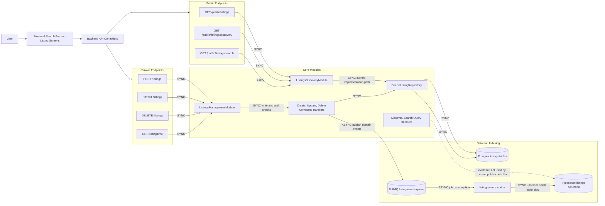
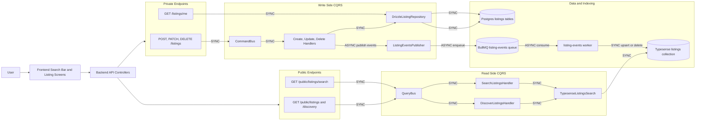
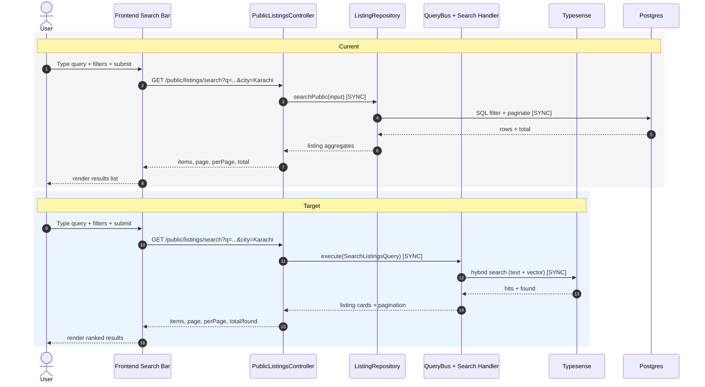
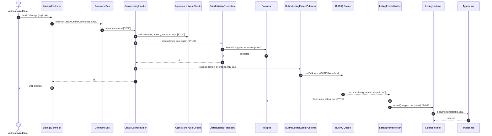

# Search, Discovery, and Listing Creation Flow

This document explains how search/discovery and listing creation currently work, and how the target flow should work.

## Scope

- Search bar interaction flow (UI to backend).
- Public listing APIs: discovery and search.
- Authenticated listing APIs: create, update, delete.
- Internal backend modules and sync vs async boundaries.

## Sync vs Async Legend

- `SYNC`: request/response path; caller waits for completion.
- `ASYNC`: queued/background path; caller does not wait for completion.

## Diagram 1: Current End-to-End Flow

## Diagram 2: Target End-to-End Flow

## Diagram 3: Search Bar Runtime Flow (Current vs Target)

## Diagram 4: Listing Create Internal Modules (Sync and Async)

## API Responsibilities at a Glance

| API | Purpose | Current data source | Target data source | Sync/Async |
| --- | --- | --- | --- | --- |
| `GET /public/listings` | Public browse list | Postgres via `ListingRepository.listPublic` | Typesense via `DiscoverListingsHandler` | Sync |
| `GET /public/listings/discovery` | Discovery feed | Postgres via `ListingRepository.listPublic` | Typesense via `DiscoverListingsHandler` | Sync |
| `GET /public/listings/search` | Text/filter search | Postgres via `ListingRepository.searchPublic` | Typesense via `SearchListingsHandler` | Sync |
| `GET /listings/me` | Owner dashboard list | Postgres | Postgres | Sync |
| `POST /listings` | Create listing | Postgres write + queue publish | Postgres write + queue publish | Sync + Async |
| `PATCH /listings` | Update listing | Postgres write + queue publish | Postgres write + queue publish | Sync + Async |
| `DELETE /listings` | Delete listing | Postgres delete + queue publish | Postgres delete + queue publish | Sync + Async |

## What Happens at Each Point (Quick Narrative)

1. User submits search in the frontend search bar.
2. Frontend sends validated query params to public search API.
3. Backend validates DTO and executes discovery/search path.
4. Current path reads from Postgres repository; target path reads from Typesense query handlers.
5. Backend returns paginated items for rendering.
6. For create/update/delete, backend writes Postgres first and returns API response.
7. Indexing happens asynchronously through queue + worker, then Typesense becomes eventually consistent with source-of-truth data.

## Notes for Product and Engineering Alignment

- Search freshness is eventually consistent because index updates happen after write response.
- Postgres remains source of truth for listing ownership, authorization, and write operations.
- Typesense is optimized for fast public discovery/search and ranking quality.
- A short delay between create/update/delete and search visibility is expected by design.
